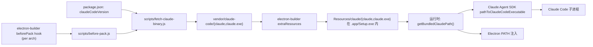

# 内置 Claude Code 交接文档

> 产品思考见 [docs/insights/bundled-claude-code.md](../insights/bundled-claude-code.md)

## 摘要

CodePilot 现在直接打包 Anthropic 官方 Claude Code 原生二进制（每平台 ~210 MB，每个 arch 一份）。运行时永远使用内置二进制，用户机器上其他渠道安装的 `claude` 仅作信息展示。这意味着：

- **用户无需安装 Node.js、npm、Bun 或运行 `curl claude.ai/install.sh`**
- **DMG 体积从 ~150 MB 增至 ~360 MB**（每个 arch），EXE 同步增大
- **Claude Code 版本跟随 CodePilot 发版升级**，不做后台静默升级

## 总体架构



构建期 → 打包期 → 签名期 → 运行期四段清晰分离。

## 目录结构

| 文件 | 角色 |
|------|------|
| [scripts/fetch-claude-binary.js](../../scripts/fetch-claude-binary.js) | 从 npm registry 拉对应平台的 tarball、校验 sha512、解压到 `vendor/claude-code/` |
| [scripts/before-pack.js](../../scripts/before-pack.js) | electron-builder `beforePack` 钩子，per-arch 调用 fetcher 把目标 binary 准备好 |
| [scripts/after-sign.js](../../scripts/after-sign.js) | macOS 签名扩展：ad-hoc 模式下手动 codesign 内置 binary；Developer ID 模式下用 runtime entitlements 重签 |
| [electron-builder.yml](../../electron-builder.yml) | `extraResources: vendor/claude-code/ → claude/`，`beforePack: scripts/before-pack.js` |
| [src/lib/platform.ts](../../src/lib/platform.ts) | `getBundledClaudePath()`、`'bundled'` install type、`findClaudeBinary()` 永远优先返回内置路径 |
| [electron/main.ts](../../electron/main.ts) | `getBundledClaudeDir()` + `getExpandedShellPath()` 把内置目录前置到 PATH |
| [src/app/api/claude-status/route.ts](../../src/app/api/claude-status/route.ts) | API 端点报告 `installType: 'bundled'`，去掉 update 检测 |
| [src/components/layout/ConnectionStatus.tsx](../../src/components/layout/ConnectionStatus.tsx) | 顶栏胶囊显示 "Bundled vX.Y.Z"，其他 install 仅信息展示 |

## 数据流

### 构建期（开发者本地或 CI）

1. `npm run electron:pack`（或 CI build）触发 `electron-builder`
2. `electron-builder` 调用 `scripts/before-pack.js`，**per-arch** 传入 `context.packager.platform.name` 和 `context.arch`
3. `before-pack.js` 把 `mac/windows/linux` + `0/1/3` 解码成 `darwin/win32/linux` + `ia32/x64/arm64`，再 spawn `node scripts/fetch-claude-binary.js --platform=<X> --arch=<Y>`
4. `fetch-claude-binary.js` 从 `package.json` 读 `claudeCodeVersion`（当前 `2.1.119`），构造 npm registry URL 拉 tarball：
   - `https://registry.npmjs.org/@anthropic-ai/claude-code-{platform}-{arch}/-/claude-code-{platform}-{arch}-{version}.tgz`
   - 用 `dist.integrity`（sha512）做 streaming 校验
5. 解压 tarball 中的 `package/claude`（Windows 是 `package/claude.exe`）到 `vendor/claude-code/<exe>`，Unix `chmod 0o755`
6. 自检（host 平台）：`<vendor>/claude --version`，30s 超时（首次冷启动较慢）

### 打包期

1. fetcher 完成后，`electron-builder` 把 `vendor/claude-code/` 拷贝到 `<appOut>/<App>.app/Contents/Resources/claude/` 或 Windows 的 `<appOut>/resources/claude/`
2. `extraResources` 不会进 ASAR，所以 binary 保持可执行
3. 后续逻辑（codesign、notarize、squirrel/NSIS 打包）正常进行

### 签名期（macOS only）

1. **Developer ID 路径**（`scripts/after-sign.js`）
   - 显式 `codesign --force --options runtime --timestamp --entitlements build/entitlements.mac.plist --sign "$CSC_NAME" Contents/Resources/claude/claude`
   - 必须在 verify 之前重签，否则 Anthropic 原签会被外层 `--deep` 覆盖打散
2. **Ad-hoc 路径**（`CSC_LINK` 未设置时的开发签名）
   - **Step 0**：先 ad-hoc 签内置 binary（防止外层 .app 签名时报告 inner sealed entity）
   - Step 1+：照旧签其他 native binaries / frameworks / Electron Helper / 主 .app

Windows 不需要专门处理 — electron-builder 用 SignTool 走默认 deep sign 流程即可。

### 运行期

1. **Electron 启动**：`electron/main.ts` 中 `getBundledClaudeDir()` 解析路径
   - 生产：`process.resourcesPath/claude/`
   - 开发：`<repo>/vendor/claude-code/`
2. `getExpandedShellPath()` 把这个目录前置到 PATH 给 child processes
3. **Next.js / API 路由**：`src/lib/platform.ts` 的 `findClaudeBinary()` 永远先调 `getBundledClaudePath()`
   - Production: `path.join(process.resourcesPath, 'claude', exe)`
   - Dev fallback: `path.join(process.cwd(), 'vendor', 'claude-code', exe)`
   - `process.resourcesPath` 是 `/` 或 `''` 时（Next.js standalone server）走 dev fallback
4. **Claude Agent SDK 调用**：`src/lib/claude-client.ts` 通过 `findClaudePath()` → `findClaudeBinary()` → 内置二进制；SDK 把这个路径作为 `pathToClaudeCodeExecutable` 传给 Claude Code 子进程
5. **UI**：`/api/claude-status` 返回 `{installType: 'bundled', binaryPath: <Resources/claude/claude>, otherInstalls: [...]}`，顶栏胶囊显示 "Bundled vX.Y.Z"，其他 install 列在下拉里仅作信息

## 关键设计决策

### 为什么直接从 npm registry 拉 tarball，而不是 `npm install`

跨平台构建时（如 arm64 mac 上打 x64 DMG），`npm install` 默认装的是构建主机的 `optionalDependencies`，不是目标平台的。直接 `fetch + checksum + extract` 完全可控、可校验、不污染 `node_modules`。

### 为什么用 `extraResources` 而不是 `asarUnpack`

`extraResources` 本来就在 ASAR 之外，不需要再 unpack；同时大文件（200 MB binary）放 ASAR 解压会让冷启动变慢。`asarUnpack` 适合"代码里 require 但需要 dist 里实体存在"的场景，这里只是个 fork 出去的 child process binary。

### 为什么必须重签内置 binary（macOS）

Anthropic 用 `Developer ID Application: Anthropic PBC` 签了 Claude Code，但当 electron-builder 用 `--deep` 签外层 .app 时，会把整个 bundle（含 `Resources/claude/claude`）当作要签的内容。如果我们不显式先重签内置 binary：

- **Ad-hoc 模式**：会出现 "resource fork, Finder information, or similar detritus not allowed" 或 "code object is not signed at all" 错误
- **Developer ID 模式**：可能通过签名但 notarization 会失败，因为 inner binary 的签名权和 outer .app 不一致

修复办法：在 `scripts/after-sign.js` 中显式调 `codesign --force` 重签内置 binary，让 inner / outer 签名 identity 一致。

### 为什么永远用内置版本，不做"用户版优先"混合

- **可重现性**：CodePilot 测过的就是这个 Claude Code 版本，用户机器上的 `claude` 可能是几个月前的旧版，bug repro 会变得不确定
- **简化运维**：不用维护 "最低支持版本" 矩阵
- **跨平台一致**：同一 CodePilot 版本在 Mac/Win/Linux 上行为一致
- 用户系统的 `claude` 仍可独立使用，互不干扰

### 为什么不做后台静默升级 bundled binary

跟随 CodePilot 发版上线，避免：

- 进度条 / 网络中断中途的部分升级状态
- 升级期间正在跑的会话 (`claude code` 子进程) 被中断
- 二进制和 SDK / API schema 版本错位

如果 Anthropic 发布关键修复，CodePilot 同步发 patch release。

## 版本管理

- `package.json` 的 `claudeCodeVersion` 字段是唯一权威版本号
- 升级时改这个字段 + `npm install` + commit + 走正常发版流程
- CI 会在 `beforePack` 阶段重新拉对应版本的 tarball，不用预生成 `vendor/`
- `.gitignore` 排除 `/vendor/`

## 测试

- [src/__tests__/unit/bundled-claude-path.test.ts](../../src/__tests__/unit/bundled-claude-path.test.ts) — 单元测试覆盖：
  - `getBundledClaudePath()` 找不到时返回 undefined
  - 开发环境下走 cwd-relative fallback
  - 生产环境优先 `resourcesPath`
  - sentinel 路径（`'/'`、`''`）被忽略
  - `classifyClaudePath()` 把 bundled 路径归为 `'bundled'`
  - 用户安装路径仍被正确分类
  - `getUpgradeCommand('bundled')` 返回 no-op shape

本地完整验证流程：

```bash
# 1. 单测
npm run test

# 2. 打 macOS DMG（注意 ~10 分钟）
npx electron-builder --mac arm64 --config electron-builder.yml

# 3. 检查体积
ls -lh release/*.dmg

# 4. 检查签名
codesign --verify --deep --strict release/mac-arm64/CodePilot.app

# 5. 安装、启动、发一条消息，看日志确认 SDK 调用 Resources/claude/claude
```

## 已知约束 / 边界情况

- **Linux musl/glibc**：fetcher 跑在 build 主机上，CI 默认 glibc。要跨 musl 构建时，环境变量 `CODEPILOT_CLAUDE_LIBC=musl` 会让 `before-pack.js` 把 `--arch` 拼成 `x64-musl`/`arm64-musl`
- **首次启动 quarantine（macOS）**：用浏览器下载 DMG 时整个 .app 含 quarantine flag。因为 outer 用 Developer ID 签 + inner binary 也被重签，Gatekeeper 验证一次通过即可
- **bundled binary 缺失**：用户手动删了 `Resources/claude/claude` 时，`/api/claude-status` 返 `connected: false` 并提示重装 CodePilot。`findClaudeBinary()` 不会回退到用户 `claude`
- **包体增长**：单 DMG 从 ~150 MB → ~360 MB，可接受。GitHub Release 单文件 2 GB 内仍宽松

## 上下游模块

- 上游：[ARCHITECTURE.md](../../ARCHITECTURE.md) 的 "环境检测与原生集成" 章节
- 下游：
  - [docs/handover/cli-upgrade-proxy.md](./cli-upgrade-proxy.md) — 已被本方案大幅简化，仅保留 Git Bash 引导
  - [docs/handover/onboarding-setup-center.md](./onboarding-setup-center.md) — Setup Center 中 Claude Code 卡片的"已内置"状态展示

## 删除清单

迁移到内置版本时，下列代码 / 文档已退役（commit 历史可追）：

- `src/components/layout/InstallWizard.tsx`（整个组件删除）
- `electron/main.ts` 的 `install:check-prerequisites` / `install:start` / `install:cancel` / `install:get-logs` IPC handlers
- `electron/preload.ts` 的对应 ipcRenderer.invoke 暴露
- `src/types/electron.d.ts` 的 `ClaudeInstallDetection` 接口
- `/api/claude-status` 的 `updateAvailable` / `manualUpdateChannel` / `latestVersion` 字段
- 所有 `connection.notInstalled` / `connection.installPrompt` / `connection.upgrade*` i18n key
